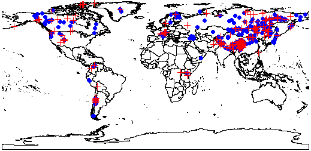

The code in this repository was used to produce a dataset of 840 plant taxa reported as occurring in alpine systems.  We extracted climate data for the full range of every species, identified the coldest temperature within its range and extracted the location co-ordinates at which this temperature was reported.  Our full dataset also includes information on seed morphology (presence or absence of an endosperm) and seed mass.

We hope that our dataset will be valuable in predicting the impact of the loss of snow cover on plants in alpine areas.

  *Global distribution of locations at which species attain the coldest temperatures in their respective ranges. Blue circles denote endospermic species occurrences, red crosses denote non-endospermic species occurrences.*

For full explanation of data and intended uses, please see the following citation:
Jaganathan & Dalrymple 2019. Internal Seed Structure of Alpine Plants and Extreme Cold Exposure. Data, 4(3), 107; https://doi.org/10.3390/data4030107
